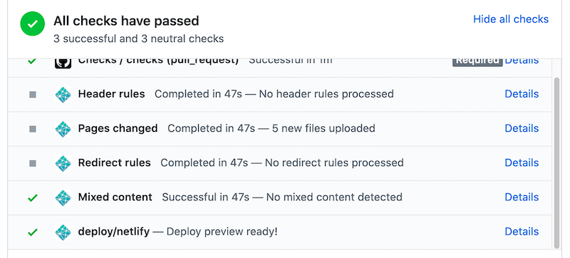

# ⚒️ Contributing to the UBC Launch Pad Website

This document will guide you through contributing changes to the new UBC Launch Pad website! It assumes basic knowledge of git and pull request workflows. If you are looking for *what* you can contribute, see:

* [our issue tracker](https://github.com/ubclaunchpad/ubclaunchpad.com/issues)
* [TODOs in the codebase](https://sourcegraph.com/search?q=repo:%5Egithub%5C.com/ubclaunchpad/ubclaunchpad%5C.com%24+TODO+-file:.md&patternType=literal)

If you spot anything out of date or incorrect, please [open an issue](https://github.com/ubclaunchpad/ubclaunchpad.com/issues)!

<br />

**Table of Contents**

- [Dependencies](#dependencies)
  - [npm Dependencies](#npm-dependencies)
- [Development](#development)
  - [Project Overview](#project-overview)
    - [Scripts](#scripts)
  - [TypeScript Guidelines](#typescript-guidelines)
  - [Vue Guidelines](#vue-guidelines)
    - [Documentation](#documentation)
    - [Styling](#styling)
      - [Responsive Design](#responsive-design)
  - [Assets and Images](#assets-and-images)
    - [Icons](#icons)
  - [Analytics](#analytics)
  - [Configuration](#configuration)
  - [Tools](#tools)
- [Deployment](#deployment)
  - [Performance](#performance)
- [GitHub Actions](#github-actions)

<br />

## Dependencies

The most important dependencies of this project are:

* [Node](https://nodejs.org), which powers all of our Javascript development locally
* [TypeScript](https://www.typescriptlang.org/), a typed superset of JavaScript
* [Vue.js](https://vuejs.org), a framework for building web interfaces
* [Bulma](https://bulma.io), a pure-CSS layout/component framework
* [animate.css](https://github.com/daneden/animate.css), a pure-CSS animation framework
* [Sass (`.scss` syntax)](https://sass-lang.com/documentation/syntax), a stylesheet language we use for styling

To get started, make sure you have [Node](https://nodejs.org/en/download) installed:

```sh
node -v
npm install
```

Refer to the links above for more details on each dependency.

Once you are set up, you can run the website locally by running the following and visiting [`localhost:8081`](http://localhost:8081) - see [Scripts](#scripts) for more details:

```
npm run serve
```

### npm Dependencies

[npm](https://docs.npmjs.com/about-npm/) is a package registry for JavaScript/Typescript/etc libraries. Our npm dependencies are declared in [`package.json`](./package.json).

When declaring dependencies in `package.json`, always use the [`~` operator](https://docs.npmjs.com/about-semantic-versioning#using-semantic-versioning-to-specify-update-types-your-package-can-accept), which specifies that the `npm install` should only use the latest patch updates of dependencies, and not automatically upgrade to the latest minor updates without explicitly being told to do so.

<br />

## Development

[Visual Studio Code](https://code.visualstudio.com/) with extensions like [Vetur](https://marketplace.visualstudio.com/items?itemName=octref.vetur) and [ESLint](https://marketplace.visualstudio.com/items?itemName=dbaeumer.vscode-eslint) is recommended.

### Project Overview

This codebase is largely contained in [`src`](/src), where you will find the following directories, with particularly important ones highlighted:

* ⭐ [`src/assets`](./src/assets): assets (images, etc.) that get bundled in the application - see [Assets and Images](#assets-and-images) for more details
* [`src/components`](./src/components): Vue components that are shared throughout the website
* ⭐ [`src/sections`](./src/sections): the website is mostly designed around horizontal sections that you scroll through - each section you see is defined as a Vue component here. Any content that cannot be configured with `config.ts` will likely be hardcoded in one of these sections.
* [`src/lib`](./src/lib): library of utility functions for Vue components
* [`src/mixins`](./src/mixins): Vue components can share logic through [Mixins](https://vuejs.org/v2/guide/mixins.html) - Mixins in use in this project are included here
* [`src/data`](./src/data): data type definitions for configuration used in the website - see [Configuration](#configuration) for more details
* ⭐ [`src/styles`](./src/styles): global styles are declared here and imported throughout the application

Also noteworthy are the following files:

* [`src/config.ts`](./src/config.ts): website configuration for frequently updated values - refer to the [Configuring the UBC Launch Pad Website](https://ubclaunchpad.com/config) documentation site and [Configuration](#configuration) for more details. It should *only* be imported by `App.vue`.
* [`src/App.vue`](./src/App.vue): the main entrypoint component to the site - it declares the site layout and provides data from `src/config.ts` to relevant sections components. When you create a new Section, add it here.

Refer to [Dependencies](#dependencies) for our core dependencies and links to their websites, where you can find documentation on how to use them. Also refer to the existing code and components for guidance on how to work with the codebase.

#### Scripts

Some handy scripts/tasks are available in `package.json`:

* `npm run serve` publishes code you write automatically at [`localhost:8081`](http://localhost:8081).
* `npm run build` builds the website and runs other build-related tasks (see `postbuild`), placing the output into `/dist`. You can preview the contents of a build with `npm run serve-dist`.
* `npm run lint` reports style and static analysis errors, and can fix some of them for you.
* `npm run vue-ui` starts up the Vue tooling user interface, which you might find helpful! All the above scripts can be run using this UI.

[](https://medium.com/the-vue-point/vue-cli-3-0-is-here-c42bebe28fbb)

### TypeScript Guidelines

[TypeScript](https://www.typescriptlang.org/) is a typed superset of JavaScript, and is used as the main programming language in this project.

Most simple style rules are enforced using [`eslint`](https://eslint.org/). Our `eslint` rules are defined in [`package.json`](./package.json). In general:

* always use `<script lang="ts">` in Vue components.
* always use `.ts` when adding additional source files.
* follow documentation formats used by existing code in the repository.

### Vue Guidelines

[Vue.js](https://vuejs.org) is a framework for building web interfaces, and is the framework that drives this project.

In general, when working with Vue:

* use [Vue single file components](https://vuejs.org/v2/guide/single-file-components.html) defined in `.vue` files.
* stick to [`Vue.extend`](https://vuejs.org/v2/api/#Vue-extend) (and not class-based components) - see [examples](https://sourcegraph.com/search?q=repo:%5Egithub%5C.com/ubclaunchpad/ubclaunchpad%5C.com%24+Vue.extend+lang:vue&patternType=literal)

#### Documentation

* Add a simple block docstring above `Vue.extend` for all components. For example:
  ```ts
  /**
   * About implements a section for introducing visitors to Launch Pad.
      */
  export default Vue.extend({
    name: 'About',
    props: {},
  });
  ```
* Shared components (`src/components`) should document their props as well with block docstrings:
  ```ts
  /**
   * Button is a simple stylized Launch Pad button.
    */
  export default Vue.extend({
    name: 'Button',
    props: {
      /**
       * Toggle whether to use a primary, attention-grabbing style or a more lowkey style for this button
        */
      primary: Boolean,
    },
  });
  ```

#### Styling

* Stylesheets should use [Sass (`.scss`) syntax](https://sass-lang.com/documentation/syntax).
* **Use existing classes wherever possible** - refer to the [Bulma](https://bulma.io) and [animate.css](https://github.com/daneden/animate.css) documentation for what is available. Other global styles are also available in [`src/styles`](./src/styles).
* Simple, non-specific styles (`margin`, `padding`, other modifiers) should be defined in [`src/styles`](./src/styles/util.scss).
* Vue declares a `<style />` section at the end of each single file component - use this and `scoped` styles for component-specific styles to avoid making unintentional changes to other components, for example:
  ```html
  <style scoped lang="scss">
  h2 {
    margin-bottom: 84px;
  }
  </style>
  ```

See [examples](https://sourcegraph.com/search?q=repo:%5Egithub%5C.com/ubclaunchpad/ubclaunchpad%5C.com%24+%3Cstyle+lang:vue&patternType=literal).

##### Responsive Design

There are several strategies to handle responsiveness (in other words, how well the website scales onto smaller/larger screens):

* [Bulma](https://bulma.io) has a variety of [helpers](https://bulma.io/documentation/modifiers/responsive-helpers/) for implementing responsiveness, and each Bulma component likely has a few modifiers to handle scaling on various screen sizes - see their respective class documentation for more details.
  * Bulma hide/show helpers (`is-hidden-` classes) are particularly useful for hiding/showing alternative layouts on different screen sizes - see [examples](https://sourcegraph.com/search?q=repo:%5Egithub%5C.com/ubclaunchpad/ubclaunchpad%5C.com%24+is-hidden-+lang:vue&patternType=literal)
* [`variables.scss`](./src/styles/variables.scss) has definitions for breakpoints (`$tablet`, `$touch`, etc.) that you can use with `@media` queries in your styles to define screen-size-specific properties - see [examples](https://sourcegraph.com/search?q=repo:%5Egithub%5C.com/ubclaunchpad/ubclaunchpad%5C.com%24+%40media+lang:vue&patternType=literal).

### Assets and Images

Image assets are kept in [`src/assets`](./src/assets), and are bundled alongside our code during build time. To reference images in Vue:

```html

```

To load an image to use it as a variable, use `require` and bind it to `src` ([examples](https://sourcegraph.com/search?q=repo:%5Egithub%5C.com/ubclaunchpad/ubclaunchpad%5C.com%24+%40/assets+lang:vue&patternType=literal))

```vue
<template>
  
</template>

<script lang="ts">
import Vue from 'vue';

const myImage = require('@/assets/my-image.png');

export default Vue.extend({
  // ...
  data: () => ({ myImage }),
  // ...
})
</script>
```

In general:

* if the image can be hosted elsewhere (i.e. a company website or project repository), host it there instead and reference it by URL
* if you do add an asset to this repository, do not put assets in `/public`, and prefer to import them as demonstrated above from the `/assets` folder.
* use suitably-sized assets that don't exceed roughly **100kB** in size (try an online image compressor, such as [compresspng](https://compresspng.com/), or whatever is suitable for your format - images can get surprisingly small!)
* **lazy-loading**: [`vue-lazyload`](https://github.com/hilongjw/vue-lazyload) provides some lazy-loading capabilities for images, but *be careful where you use this*! Especially when animated, lazy-loaded images can look quite bad, since they can just pop up mid-animation ([more context here](https://github.com/ubclaunchpad/ubclaunchpad.com/pull/142))

We also have an [automated workflow](https://github.com/ubclaunchpad/ubclaunchpad.com/actions?workflow=Compress+images) that runs on PRs that edit images and automatically adds a commit to compress them if possible while minimizing quality loss - see [GitHub Actions](#github-actions).

⚠️ Note that some of our assets are leveraged in other projects - [this query](https://sourcegraph.com/search?q=repo:ubclaunchpad/*+%22https://raw.githubusercontent.com/ubclaunchpad/ubclaunchpad.com%22&patternType=regexp) shows all repositories that currently depend on assets in this repository. Be careful not to remove assets without updating their respective dependents!

#### Icons

Try not to use images for icons! We use a third-party icon set - for more details, see [`unicons.ts`](./src/unicons.ts).

### Analytics

We use [Google Analytics](https://analytics.google.com/analytics/web) to log events. In general, track interesting actions as [events](https://support.google.com/analytics/answer/1033068), and use the following scheme:

```ts
this.$gtag.event(
  // name of event, namespaced if appropriate - such as 'project-modal-link-click'
  'my-action-name',
  {
    // name of section or part of website - be consistent with this. In general, the name of the
    // component, accesisble via `this.$options.name`, should suffice
    event_category: this.$options.name,
    // value associated with event, such as a project name 
    event_label: 'Some Value',
  },
);
```

The library we use for this is [`vue-gtag`](https://matteo-gabriele.gitbook.io/vue-gtag/), and the client is available through `this.$gtag` in Vue.

Reported analytics are available under the `team@ubclaunchpad.com` account in [Google Analytics](https://analytics.google.com/analytics/web), where you can see visitor counts, browser statistics, the events reported by `$gtag.event`, and more.

### Configuration

Site configuration is defined in [`src/config.ts`](./src/config.ts), with additional relevant types defined in [`src/data/types.ts`](./src/data/types.ts). Docstrings and types in these files are used to render the [UBC Launch Pad Site Configuration Guide](https://ubclaunchpad.com/config) as part of the post-build step to `npm run build` or by running:

```
npm run docs
```

Included in this documentation website is [CONFIGURING.md](./CONFIGURING.md), where any updated guidance regarding the configuration of the website should be added.

You can view the configuration documentation site locally using `npm run serve-dist`

```sh
npm run build # includes `npm run docs`
npm run serve-dist
```

The website will be available at `http://localhost:5000/config`.

These changes are published automatically when merged into the `master` branch - see [Deployment](#deployment).

### Tools

[`/tools`](./tools) contains useful scripts, such as:

* [`generateRedirects.ts`](./tools/generateRedirects.ts): generates [Netlify redirects](https://docs.netlify.com/routing/redirects/#syntax-for-the-redirects-file) from [`config.ts`](./src/config.ts) (see [USING.md](./USING.md#redirect-links))
* [`stripRequire.sh`](./tools/stripRequire.sh): pre-processes compiled JavaScript for execution

Tools are generally used through one of our [Scripts](#scripts).

<br />

## Deployment

Deployments are handled automatically by the [Netlify](https://www.netlify.com/) - the website is managed under the "Launch Pad OSS Sponsored" team. Build and deploy options can be declared in [`netlify.toml`](./netlify.toml).

This means that when your changes are merged to `master`, your contribution will automatically be deployed! This deployment includes both the actual website as well as [configuration documentation](#configuration).

Also note that individual pull requests also get their own preview deployment - you can find a link by clicking on "Details" next to the `deploy/netlify` check at the bottom of your pull request:



### Performance

You can use [`web.dev/measure`](https://web.dev/measure/) to check on the performance of `ubclaunchpad.com`. You can also provide the link to a Netlify deploy preview to the tool.

`web.dev` points out areas for improvement in web performance, accessibility, best practices, and search engine optimization - you can see a full report for the deployed website [here](https://lighthouse-dot-webdotdevsite.appspot.com//lh/html?url=https%3A%2F%2Fubclaunchpad.com).

<br />

## GitHub Actions

[GitHub Actions](https://github.com/features/actions) is a workflow automation platform provided by GitHub. We use it for automating a variety of tasks for this project.

* [](https://github.com/ubclaunchpad/ubclaunchpad.com/actions?workflow=Checks) ([`checks.yml`](./.github/workflows/checks.yml)) is our continuous integration workflow: it runs on every single pull request to run linters and verify the website builds correctly. Every pull request should pass these checks.
* [](https://github.com/ubclaunchpad/ubclaunchpad.com/actions?workflow=Compress+images) ([`compress.yml`](./.github/workflows/compress.yml)) runs on pull requests that modify image assets and, if possible, compresses them without losing too much quality. You should still only add images of suitable size regardless - see [Assets and Images](#assets-and-images).

<br />
