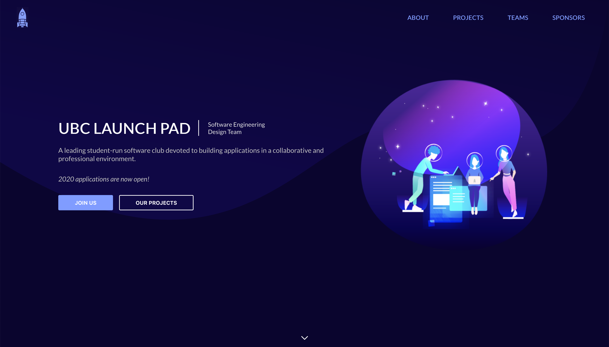

  

  preview of the new UBC Launch Pad website

  
  
  

 

  <a href="https://ubclaunchpad.github.io/new/config"><strong>Configuring</strong></a> · 
  <a href="./CONTRIBUTING.md"><strong>Contributing</strong></a>

 
