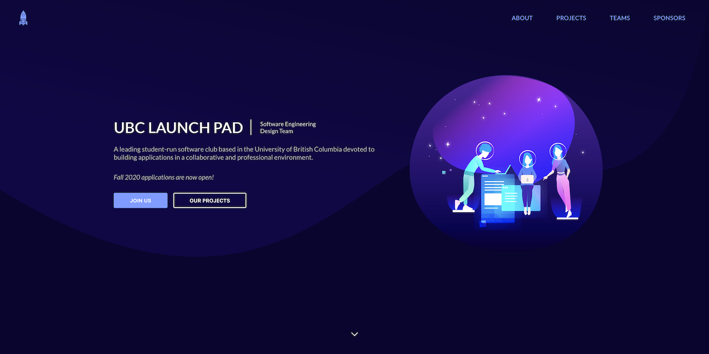

  

  the new, official UBC Launch Pad website - <a href="https://ubclaunchpad.com">ubclaunchpad.com</a>

  
  
  

 

## 🔎 Using

The [Usage Guide](./USING.md) documents tips for using this website, such as how to check what redirects are currently available.

## ⚙️ Configuring

Want to make a change to the website? Most content can be updated using the website's configuration file - for example, the currently featured projects or recruitment status. Head on over to the [Site Configuration Guide](https://ubclaunchpad.com/config) for more details.

## ⚒️ Contributing

Want to hack on the website, fix bugs, develop new features, or make changes that can't but made using [site configuration](#configuring)? Out [Contribution Guide](./CONTRIBUTING.md) has everything you need to get started!

 
